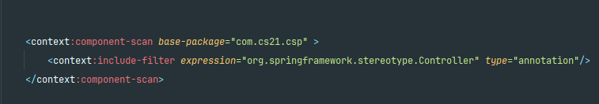
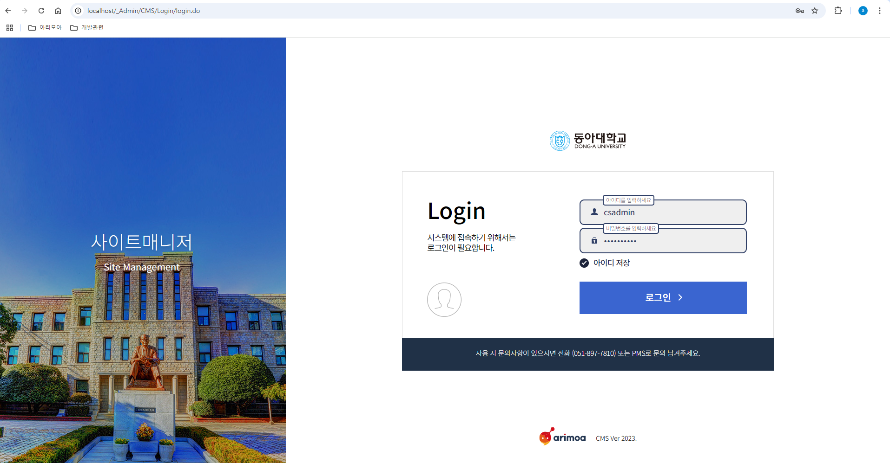
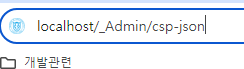
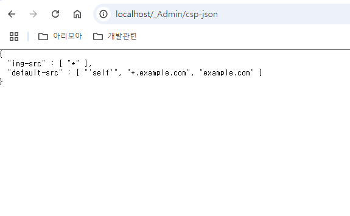

# CSP(Content Security Policy) 공통 응답 헤더 모듈

## 기능 정의

> - (1) Response Header에 CSP 삽입 기능
> - (2) Admin 접근자에 한하여 CSP 정책에 대한 내용 조회 및 수정 기능
> - 상기 해당 기능은 백엔드 개발자의 라이브러리 추가 및 web 설정만으로 이루어지며   
    이후 유지보수에 대해서는 리소스 담당자(퍼블리셔, 디자이너)분들을 대상으로 만들어졌습니다.

--- 

 
 구성 방법 

--- 
## 0. jar 라이브러리 추가
- 실행 환경에 맞게 **jar파일(csp-1.0.0.jar)** 추가

## 1. Response Header에 CSP 삽입 기능

### 목적

응답 헤더값에 CSP를 삽입하기 위해서 본 모듈에서는 필터로 구현하였으며,   
따라서 필터의 매핑이 필요합니다.   
필터의 매핑에는 다음과 같은 정보가 필요합니다.

- DB 권한정보
  > - driver class name
  > - db url
  > - db username
  > - db password)

### 수행

- 해당 권한 정보를 **구현된 필터(CspResponseFilter.class)** 에 매핑 시 함께 세팅합니다.

> 
> - webApplicationInitializer 에 세팅
~~~ java
String driverClassName = CentumProperties.getProperty("jdbc.driverClassName");
String url = CentumProperties.getProperty("jdbc.url");
String username = CentumProperties.getProperty("jdbc.username");
String password = CentumProperties.getProperty("jdbc.password");

FilterRegistration.Dynamic cspFilter = servletContext.addFilter("cspFilter", new CspResponseFilter());
cspFilter.setInitParameter("className", driverClassName);
cspFilter.setInitParameter("url", url);
cspFilter.setInitParameter("username", username);
cspFilter.setInitParameter("password", password);
cspFilter.addMappingForUrlPatterns(null, false, "*.do");
~~~

## 2. Admin 접근자에 한하여 CSP 정책에 대한 내용 조회 및 수정 기능

- 컴포넌트 스캔 범위에 해당 **com.cs21.csp** 패키지를 추가합니다.

> 
> - 컴포넌트 스캔 범위에 com.cs21.csp의 컨트롤러 어노테이션 추가
~~~ xml
<context:component-scan base-package="com.cs21.csp">
    <context:include-filter expression="org.springframework.stereotype.Controller" type="annotation"/>
</context:component-scan>
~~~

--- 

 
 이용 화면 

--- 

> 
> - (1) Admin 페이지 로그인

> 
> - (2) 해당 도메인 uri에 **/_Admin/csp-json** 입력

> 
> - (3) 상기와 같이 CSP가 적용된 목록을 JSON 형식으로 조회 할 수 있으며   
Submit 버튼을 눌러 수정등록이 가능하다.

