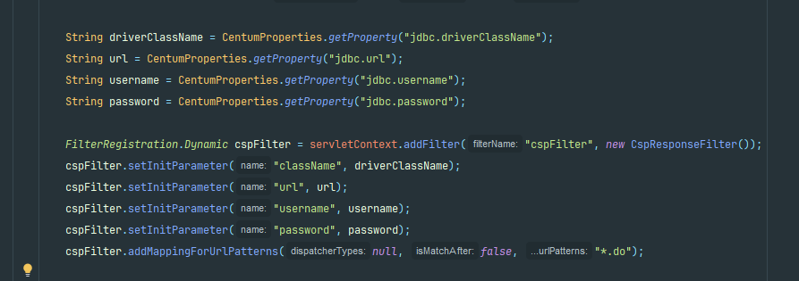

# CSP(Content Security Policy) 공통 응답 헤더 모듈

## 기능 정의

> - (1) Response Header에 CSP 삽입 기능
> - (2) Admin 접근자에 한하여 CSP 정책에 대한 내용 수정 기능
> - 상기 해당 기능은 백엔드 개발자의 라이브러리 추가 및 web 설정만으로 이루어지며   
    이후 유지보수에 대해서는 리소스 담당자(퍼블리셔, 디자이너)분들을 대상으로 만들어졌습니다.

## 구성 방법

1. Response Header에 CSP 삽입 기능 
 응답 헤더값에 CSP를 삽입하기 위해서 본 모듈에서는 필터로 구현하였으며,   
 따라서 필터의 매핑이 필요합니다.   
 필터의 매핑에는 다음과 같은 정보가 필요합니다.

- DB 권한정보
  > - driver class name
  > - db url
  > - db username
  > - db password)

 해당 권한 정보를 **구현된 필터(CspResponseFilter.class)** 에 매핑 시 함께 세팅합니다.
 
 - webApplicationInitializer 에 세팅 시

